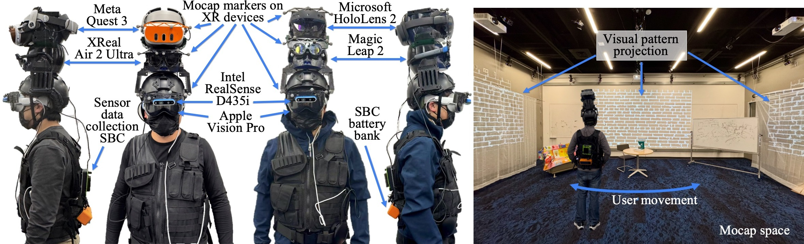

# XR Spatial Tracking Evaluation

This repository contains the **testbed implementation, datasets, calibration tools, data collection framework, and analysis pipelines** as described in the paper:

**"XR Reality Check: What Commercial Devices Deliver for Spatial Tracking"**  
Tianyi Hu, Tianyuan Du, Zhehan Qu, Maria Gorlatova  
To be presented at IEEE ISMAR 2025

---

## Overview

Accurate spatial tracking is crucial for immersive XR experiences. We introduce a novel testbed enabling **simultaneous and synchronized evaluation** of multiple commercial XR devices under identical environmental and kinematic conditions.

**Device and Environmental Setup**  


This repo includes:

- Hardware designs and instructions for multi-device mounting
- Software for synchronized pose acquisition from commercial XR devices
- Calibration procedures aligning device and motion capture reference frames
- Sensor data collection setup using Intel RealSense cameras and IMUs
- Datasets across various scenarios, devices, and controlled motion patterns
- Analysis scripts for pose error computation (Absolute and Relative Pose Error)
- Correlation analysis between sensor data and tracking errors

---

## Supported XR Devices

- Apple Vision Pro (AVP)  
- Meta Quest 3 (MQ3)  
- Microsoft HoloLens 2 (HL2)  
- Magic Leap 2 (ML2)  
- XReal Air 2 Ultra (XR2U)  
- ORB-SLAM3 baseline using Intel RealSense

---

## Repository Structure
```
/hardware
├─ MakerFrame  
│  └─ 3D-printable frames for attaching markers to XR devices  
└─ HeadFrame  
   └─ 3D-printed helmet mounts (ARC rail compatible)


/software
├─ calibration
│  ├─ extrinsic calibration tools
│  └─ timestamp synchronization utilities
├─ data_collection
│  ├─ Unity and Xcode projects for device pose recording
│  └─ sensor data collection scripts
└─ analysis
   ├─ pose error calculation (with EVO toolkit)
   └─ correlation analysis notebooks

```

## Benchmarking Dataset

You could download the benchmarking dataset using the [following link](https://drive.google.com/file/d/1xlXNyw57xoSU1rogKmdtcxHyMz768Z7Z/view?usp=sharing).

The dataset is organized in the following structure:
```
/<set>_<motion>_<environment>_<pace>
├─ data
│  ├─ <device>_error.csv              # Benchmarking error metrics for each device
│  ├─ orb_combined.csv                # Aggregated ORBSLAM error data
│  ├─ merge_result.csv                # Merged results across devices and runs
│  ├─ merge_result_filled.csv         # Merged results with missing values filled
│  ├─ <device>.png                    # Visualization of device trajectories/errors
│  ├─ ORBSLAM3.png                    # Visualization for ORBSLAM3 trajectory/errors
│  ├─ [gt]
│  │    ├─ <device>_<timestamp>.csv   # Ground truth data for each device
│  │    └─ gt_ORB.csv                 # ORBSLAM-specific ground truth
│  ├─ [sensor]
│  │    ├─ cam0.csv                   # Camera 0 sensor data (intrinsics, timestamps)
│  │    ├─ cam1.csv                   # Camera 1 sensor data
│  │    ├─ timestamp.txt              # Sensor data timestamps
│  │    ├─ [cam0]                     # Directory of cam0 images named by timestamp
│  │    │    └─ <timestamp>.png
│  │    ├─ [cam1]                     # Directory of cam1 images named by timestamp
│  │    │    └─ <timestamp>.png
│  │    └─ [imu]
│  │         └─ data.csv              # Raw IMU data (acceleration, gyro)
│  └─ [xr]
│       ├─ ORB_traj.csv               # ORBSLAM estimated trajectory
│       ├─ ORB_log.csv                # ORBSLAM log files
│       ├─ <device>_<timestamp>.csv   # Device XR trajectory logs
│       └─ <device>_<timestamp>_updated.csv  # Post-processed XR logs

```

## Getting Started

For detailed setup, please refer to the [Wiki page](https://github.com/Duke-I3T-Lab/XR_Tracking_Evaluation/wiki) of this repo.

### Prerequisites

- Unity (version 2020 or newer)  
- Xcode (for Apple Vision Pro apps)  
- Python 3.7+ with packages: numpy, pandas, matplotlib, scipy, evo  
- Intel RealSense SDK 2.0 and drivers  
- Access to motion capture system (e.g., Vicon)  

### Calibration

1. Attach infrared markers to XR devices as per hardware guide.  
2. Run extrinsic calibration to find transformations between Vicon and device coordinate frames.  
3. Perform time synchronization among motion capture, XR devices, and sensor modules.

### Data Collection

1. Mount devices on the multi-head testing rig or the subject’s head.  
2. Use provided apps to collect device pose streams and sensor data.  
3. Execute standardized motions under different environmental conditions (feature-rich / featureless).  
4. Store synchronized logs of poses, IMU data, and camera frames.

### Analysis

- Use provided Python scripts to calculate Absolute Pose Error (APE) and Relative Pose Error (RPE).  
- Utilize correlation analysis notebooks to study dependencies between tracking errors and sensor/environment parameters.

---

## Citation

If you use this work, please cite:
```
@inproceedings{hu2025xr,
title={XR Reality Check: What Commercial Devices Deliver for Spatial Tracking},
author={Hu, Tianyi and Du, Tianyuan and Qu, Zhehan and Gorlatova, Maria},
booktitle={Proceedings of the 24th International Symposium on Mixed and Augmented Reality (ISMAR)},
year={2025}
}
```

---

## License

Licensed under the MIT License.

---

## Contact

For questions or collaboration, contact:  
**Tianyi Hu**  
tianyi.hu@duke.edu  
Department of Electrical and Computer Engineering, Duke University

---

Thank you for your interest in advancing XR spatial tracking!

## Acknowledgements

This work was supported in part by NSF grants CSR-2312760, CNS-2112562, and IIS-2231975, NSF CAREER Award IIS-2046072, NSF NAIAD Award 2332744, a Cisco Research Award, a Meta Research Award, Defense Advanced Research Projects Agency Young Faculty Award HR0011-24-1-0001, and the Army Research Laboratory under Cooperative Agreement Number W911NF-23-2-0224.

