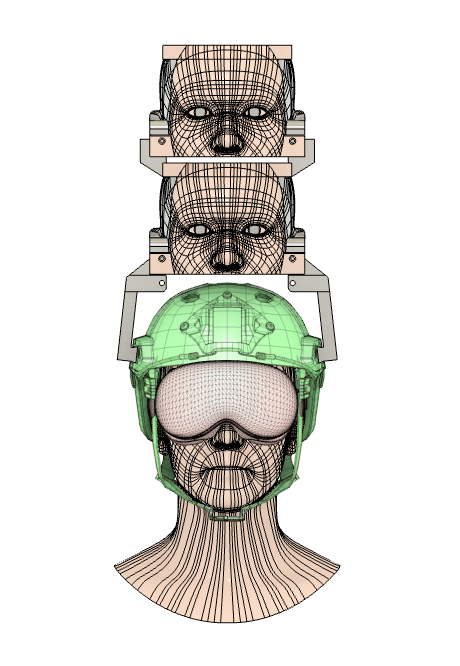

## MakerFrame
The MakerFrame folder contains 3D-printable frames custom-designed for various XR devices. These frames allow you to securely attach markers to XR hardware for tracking and experimentation purposes.

## HeadFrame
The HeadFrame folder provides 3D-printable components designed for use with helmets equipped with ARC rails. These parts enable you to mount two 3D-printed heads vertically on top of the helmet, allowing XR devices to operate under identical environmental conditions and user motions for controlled experiments.

